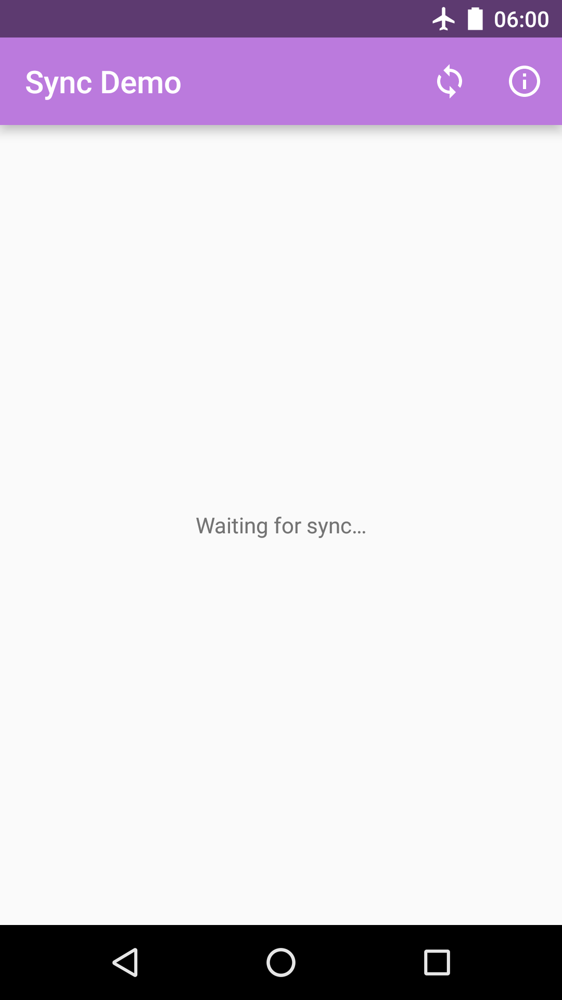
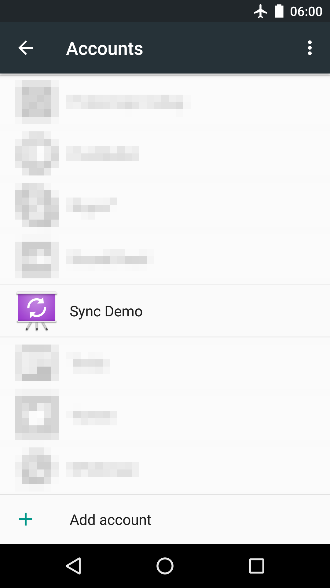
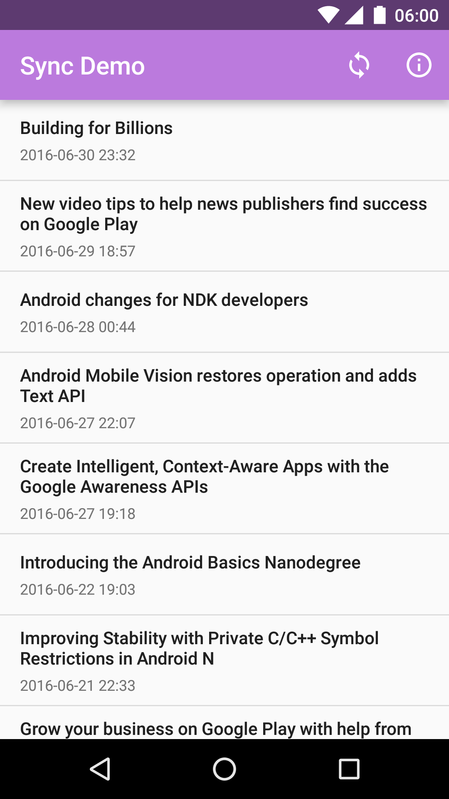

Sync Demo
=========

## Abstract

Storing account information is a common challenge many app developers face, and is often tackled in tailored solutions. Isn’t there some strategy to store account credentials in a centralized place?

What about multiple accounts, like Twitter? What about security concerns? And when should or could I synchronize data?

Android offers a powerful—and underrated—account manager. Let’s explore the possibilities together and lay out an architecture for engineering and Android app based on accounts.

## Contents

The slides and sample project used in Paul Lammertsma's 2016 season conference tour entitled _I've been doing some syncing…_

# Sample project

   

The sample is derived from [Google's Android BasicSyncAdapter Sample][1].

From the original project description:

> This sample demonstrates using SyncAdapter to fetch background
data for an app. It covers the creation of the required Service
that the OS uses to initiate the background data sync as well as
scheduling syncs with background data.

> SyncAdapters can be used to execute your data transfer
code at configurable intervals, while efficiently using battery and
other system resources.

> This sample implements all the required elements of a sync adapter.
> - Creates a sync adapter class.
> - Creates a bound Service which the OS uses to initiate a sync.
> - Defines the sync adapter properties in an XML resource file.
> - Declares the bound Service in the app manifest.

> For more on SyncAdapters refer to [Transferring Data Using Sync Adapters][2]

For details on setting up the sample project, [see the original repository][1].

License
-------

Copyright 2014 The Android Open Source Project, Inc.

Licensed to the Apache Software Foundation (ASF) under one or more contributor
license agreements.  See the NOTICE file distributed with this work for
additional information regarding copyright ownership.  The ASF licenses this
file to you under the Apache License, Version 2.0 (the "License"); you may not
use this file except in compliance with the License.  You may obtain a copy of
the License at

http://www.apache.org/licenses/LICENSE-2.0

Unless required by applicable law or agreed to in writing, software
distributed under the License is distributed on an "AS IS" BASIS, WITHOUT
WARRANTIES OR CONDITIONS OF ANY KIND, either express or implied.  See the
License for the specific language governing permissions and limitations under
the License.

[1]: https://github.com/googlesamples/android-BasicSyncAdapter
[2]: http://developer.android.com/training/sync-adapters/index.html
